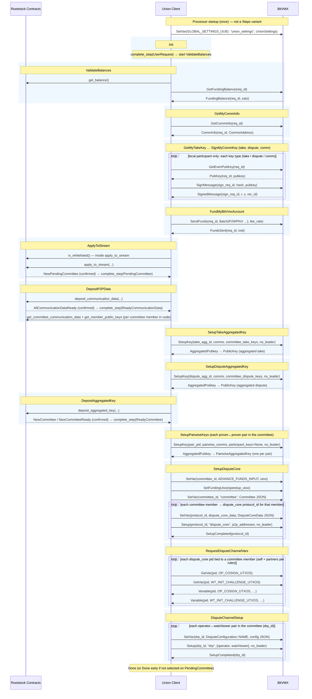

# Union Bridge Flows

This document describes the five main Union Bridge runtime flows between Rootstock smart contracts, the Union Bridge Client, and BitVMX. The goal is to show how each flow progresses over time, which milestone moves it forward, and what marks its completion.

## Intro

The Union Client sits between two networks. On the Rootstock side, it follows [contract events listened to by Union Client](rootstock-contract-events-listened-by-union-client.md), waits for the configured [confirmations, retry delays, and timeouts](confirmations-retries-and-timeouts.md), and then advances the bridge state through the relevant [contract functions called by Union Client](rootstock-contract-functions-called-by-union-client.md). On the BitVMX side, it follows the [BitVMX messages listened to by Union Client](bitvmx-messages-listened-by-union-client.md) and drives the next stage of each flow with the relevant [BitVMX actions triggered by Union Client](bitvmx-actions-triggered-by-union-client.md).

Each section focuses on the flow itself. It explains what changes in the bridge, which event or message makes that change visible, how the flow becomes more concrete or more final over time, and what can pause or divert it before completion. When a field, identifier, or transition depends on a specific derivation, the relevant detail is linked to [Parameter Sources and Mappings](parameter-sources-and-mappings.md).

## Flow: Committee Setup

Before the later bridge flows can move forward, the runtime needs a concrete committee of operators and watchtowers. That committee provides the participant list, public keys, communication endpoints, and dispute inputs that the later pegin, pegout, signature, and operator-take paths depend on.

This flow covers the transition from a committee that is only recorded on Rootstock to a committee that the runtime can actually use. By the end of the flow, the client has the member list, the communication data, the key material, and the BitVMX dispute inputs needed by the later flows.

### Sequence

The sequence starts on the BitVMX side, where the Union Client publishes `union_settings` through the relevant [BitVMX actions triggered by Union Client](bitvmx-actions-triggered-by-union-client.md). This does not make the committee ready yet, but it gives BitVMX the shared runtime context that the committee will later use.

The flow becomes visible on Rootstock when [`NewPendingCommittee`](rootstock-contract-events-listened-by-union-client.md) appears, and it advances to a concrete committee definition with [`NewCommittee`](rootstock-contract-events-listened-by-union-client.md). From there, the committee starts to accumulate the information the bridge needs. [`MemberInfoDeposited`](rootstock-contract-events-listened-by-union-client.md) shows that member-level data is being published, and [`AllCommunicationDataReady`](rootstock-contract-events-listened-by-union-client.md) shows that the communication layer is complete enough to continue.

Once the committee is visible on Rootstock, the Union Client can determine whether the local participant belongs to it. The client checks eligibility through [`is_whitelisted`](rootstock-contract-functions-called-by-union-client.md) and, when appropriate, joins through [`apply_to_stream`](rootstock-contract-functions-called-by-union-client.md). In parallel, the same participant also becomes visible on the BitVMX side. [`FundingBalance`](bitvmx-messages-listened-by-union-client.md) provides the funding context available to BitVMX, and [`CommInfo`](bitvmx-messages-listened-by-union-client.md) provides the local communication identity. At that point, the same member can be recognized on both sides of the bridge.

The next stage turns that partial state into a complete committee view that the runtime can reuse. The Union Client publishes its own communication and key material through [`deposit_communication_data`](rootstock-contract-functions-called-by-union-client.md) and [`deposit_aggregated_key`](rootstock-contract-functions-called-by-union-client.md), and then reads back the consolidated committee state through [`get_committee`](rootstock-contract-functions-called-by-union-client.md), [`get_committee_communication_data`](rootstock-contract-functions-called-by-union-client.md), and [`get_member_public_keys`](rootstock-contract-functions-called-by-union-client.md). By then, the runtime has a concrete committee, communication routes, and key material that it can carry into the dispute setup.

The final stage begins when the Union Client publishes the dispute-related inputs into BitVMX, including `ADVANCE_FUNDS_INPUT`, `committee`, and `dispute_core_data`, and starts the `dispute_core` programs through the corresponding [BitVMX actions triggered by Union Client](bitvmx-actions-triggered-by-union-client.md). The flow reaches a usable completion point when BitVMX returns the dispute-core outputs `OP_COSIGN_UTXOS` and `WT_INIT_CHALLENGE_UTXOS`. At that point, the committee is ready to support the dispute channels and, with them, the later pegin, pegout, signature, and operator-take paths.

This flow can pause if the local member is not eligible, if committee data is still incomplete, if communication endpoints or key material are still missing, or if BitVMX does not return the expected funding and dispute variables. It is also delayed by the Rootstock confirmation rules attached to the committee events that define when the setup can be treated as stable.

The sequence below is grouped by the `Steps` enum in [`setup_committee_flow.rs`](../../coordinator/src/flows/committee/setup_committee_flow.rs) (plus processor startup, which is not a flow step). Rootstock events shown with `RC-->>UC` are the ones the setup committee processor uses to advance the state machine after confirmations; [`MemberInfoDeposited`](rootstock-contract-events-listened-by-union-client.md) can still occur on-chain as members deposit keys but is not a step boundary in that processor.

In the diagram, **`loop` blocks that mention committee members** iterate over the **roster of that committee** (each member index, or each pair of members), as in the Rust code. The exception is **GetMyTakeKey … SignMyCommKey**, which only runs three times for the **local** participant (take / dispute / comm key lines), not once per committee size.



## Flow: Pegin

The pegin flow turns a Bitcoin-side deposit into a Rootstock-side accepted pegin. It starts with a deposit that exists only as a Bitcoin observation, then moves to a pegin that is recognized by Rootstock, then to a pegin with an official bridge identity, and finally to a pegin that is accepted and closed.

### Sequence

The flow begins when BitVMX reports [`PeginTransactionFound`](bitvmx-messages-listened-by-union-client.md). At that stage, the deposit exists on Bitcoin, but it is still only a candidate pegin from the bridge point of view. The client gives it a temporary identity derived from the Bitcoin transaction and waits for the corresponding [`SPVProof`](bitvmx-messages-listened-by-union-client.md). Once that proof is available, the pegin crosses into Rootstock through [`request_pegin`](rootstock-contract-functions-called-by-union-client.md), and the first decisive milestone appears as [`PeginRequested`](rootstock-contract-events-listened-by-union-client.md).

[`PeginRequested`](rootstock-contract-events-listened-by-union-client.md) is the point where the flow stops being only a Bitcoin-side observation and becomes an official bridge flow. This is where the flow receives its Rootstock identity through the relevant [`parameter sources and mappings`](parameter-sources-and-mappings.md), especially the `committee_id` and `slot_id` that replace the temporary txid-based identity. From then on, the flow is no longer just a detected deposit. It is a specific pegin assigned to a specific committee slot. With that identity in place, the client can publish the Rootstock-derived pegin context back into BitVMX so the accept-pegin branch can be prepared.

The next major change happens when BitVMX returns [`Variable(flow_id, "pegin_accepted", ...)`](bitvmx-messages-listened-by-union-client.md) with a **`PeginAcceptedMessage`**. That is not the same thing as the Rootstock [`PeginAccepted`](rootstock-contract-events-listened-by-union-client.md) event: it is the BitVMX-side payload that carries `accept_pegin_txid` (and operator transaction ids for provers). Each **Prover** then calls [`add_operator_take_tx_hash`](rootstock-contract-functions-called-by-union-client.md) on **SignatureManager**; **Verifiers** skip that call. Nothing proceeds to dispatch until Rootstock emits [`AllOperatorTakeTxidsAdded`](rootstock-contract-events-listened-by-union-client.md) (with confirmations), which is when the client starts the **BTC signature subflow**. After signatures complete, the accept-pegin transaction is dispatched, polled on Bitcoin (`GetTransaction`), and proven with a second SPV round before [`accept_pegin`](rootstock-contract-functions-called-by-union-client.md) on Rootstock.

The flow is complete when [`PeginAccepted`](rootstock-contract-events-listened-by-union-client.md) confirms on Rootstock. The client then notifies BitVMX with [`SetVar(flow_id, "PeginAccepted", ...)`](bitvmx-messages-listened-by-union-client.md) using the **string name `PeginAccepted`**, which is distinct from the incoming **`"pegin_accepted"`** variable. Before that point, the flow can still pause while waiting for proofs, Rootstock confirmations, the BitVMX payload, all operator take hashes, the signature subflow, Bitcoin maturity for the accept-pegin tx, or Native Bridge checks on the final proof.

```mermaid
sequenceDiagram
    participant BV as BitVMX / Bitcoin
    participant UC as Union Client
    participant PM as Rootstock Contracts
    participant SM as SignatureManager

    Note over UC,BV: Until PeginRequested confirms, the client tracks this flow by Bitcoin txid; afterward BitVMX uses a stable flow id from committee + slot.
    BV-->>UC: PeginTransactionFound(txid, status)
    UC->>BV: GetSPVProof(txid)
    BV-->>UC: SPVProof(txid, request_pegin_spv)
    UC->>PM: request_pegin(request_pegin_spv)
    PM-->>UC: PeginRequested (after confirmations)
    UC->>BV: GetCommInfo(req_id)
    BV-->>UC: CommInfo(req_id, CommsAddress)
    UC->>PM: get_committee (build PeginRequestMessage)
    UC->>BV: SetVar(flow_id, "pegin_request", PeginRequestMessage)
    UC->>PM: get_committee_communication_data + get_member_public_keys (per member)
    UC->>BV: Setup(flow_id, "accept_pegin", participants, 0)
    BV-->>UC: Variable(flow_id, "pegin_accepted", PeginAcceptedMessage)
    opt Prover (operator)
        UC->>SM: add_operator_take_tx_hash(accept_pegin_txid, operator_take_txid, operator_won_txid)
    end
    PM-->>UC: AllOperatorTakeTxidsAdded (after confirmations)
    Note over UC,BV: BTC signature subflow (Rootstock nonce/signature events + BitVMX)
    UC->>BV: DispatchTransactionName(flow_id, "ACCEPT_PEGIN_TX")
    UC->>BV: GetTransaction(flow_id, accept_pegin_txid)
    BV-->>UC: Transaction(flow_id, tx_status, ...)
    UC->>BV: GetSPVProof(accept_pegin_txid)
    BV-->>UC: SPVProof(accept_pegin_txid, accept_pegin_spv)
    UC->>PM: accept_pegin(accept_pegin_spv)
    PM-->>UC: PeginAccepted (after confirmations)
    UC->>BV: SetVar(flow_id, "PeginAccepted", RSK event JSON)
```

## Flow: Pegout

The pegout flow starts on Rootstock and aims to finish as a pegout that has completed its user-take path and has been registered back on Rootstock. It moves from a Rootstock request, to a Bitcoin transaction path, and then back to a Rootstock completion event.

### Sequence

The flow begins when Rootstock emits [`PegoutRequested`](rootstock-contract-events-listened-by-union-client.md). After it satisfies the configured [confirmations, retry delays, and timeouts](confirmations-retries-and-timeouts.md), the client creates a pegout flow with a **stable BitVMX `flow_id`** derived from committee and slot (see [`parameter sources and mappings`](parameter-sources-and-mappings.md)), then loads comms and BitVMX setup for the user-take program.

The next major shift happens when BitVMX returns [`Variable(flow_id, "pegout_accepted", ...)`](bitvmx-messages-listened-by-union-client.md) (`PegOutAccepted` JSON). That payload includes `user_take_txid` and the nonce/signature material used to start the **BTC signature subflow** in the same handler: Rootstock milestones such as [`AllNoncesReady`](rootstock-contract-events-listened-by-union-client.md) and [`AllSignaturesReady`](rootstock-contract-events-listened-by-union-client.md) together with BitVMX drive member nonces and signatures (against SignatureManager).

While the pegout flow is waiting in **`DispatchTransaction`** for that signature subflow, the client schedules an **advance-funds timeout** on the next Rootstock block timestamp: `advance_funds_timeout_secs` from pegout config (see [confirmations, retry delays, and timeouts](confirmations-retries-and-timeouts.md)). If signatures finish in time, the timeout is **cancelled** and the happy path continues: dispatch **`USER_TAKE_TX`**, poll **`GetTransaction`** until Bitcoin confirmations meet the threshold, **`GetSPVProof`**, and [`register_pegout`](rootstock-contract-functions-called-by-union-client.md). If Native Bridge lacks confirmations, registration may be retried on a block tick.

If the timeout **expires while the flow is still in `DispatchTransaction`** (signatures never completed), the client drops the BTC signature subflow, calls [`trigger_operator_take`](rootstock-contract-functions-called-by-union-client.md) with the pegout identifier from the original [`PegoutRequested`](rootstock-contract-events-listened-by-union-client.md) payload, and the **pegout user-take state machine goes to `Done`**. It does **not** dispatch `USER_TAKE_TX`, register the user-take pegout, or send `PEG_OUT_COMPLETED` on that path. Rootstock then emits [`OperatorTakeTriggered`](rootstock-contract-events-listened-by-union-client.md) (after its own confirmation rules), which the separate **Flow: Advance funds** consumes.

The closing milestone on the **user-take** path is [`PegoutRegistered`](rootstock-contract-events-listened-by-union-client.md) on Rootstock (again after confirmations). The client then sends [`SetVar(flow_id, "PEG_OUT_COMPLETED", ...)`](bitvmx-messages-listened-by-union-client.md) with the registered event payload.

Before that closing milestone is reached, the flow can still stall if BitVMX does not produce `pegout_accepted`, if the signature subflow does not finish, if the user-take transaction does not reach enough confirmations on Bitcoin, or if the Native Bridge rejects the SPV or registration proof.

```mermaid
sequenceDiagram
    participant PG as Rootstock Contracts
    participant UC as Union Client
    participant BV as BitVMX / Bitcoin
    participant SG as SignatureManager

    Note over UC,BV: flow_id is committee+slot from flow creation; BitVMX always uses this id for this pegout.
    PG-->>UC: PegoutRequested (after confirmations)
    UC->>BV: GetCommInfo(req_id)
    BV-->>UC: CommInfo(req_id, CommsAddress)
    UC->>PG: get_committee (build PegOutRequest)
    UC->>BV: SetVar(flow_id, "pegout_request", PegOutRequest JSON)
    UC->>PG: get_committee_communication_data + get_member_public_keys (per member)
    UC->>BV: Setup(flow_id, "take", CommsAddress participants, 0)
    BV-->>UC: Variable(flow_id, "pegout_accepted", PegOutAccepted JSON)
    Note over UC,SG: BTC signature subflow: PG AllNoncesReady / AllSignaturesReady + BitVMX; nonces/signatures on SG
    Note over UC: If advance_funds_timeout_secs elapses in DispatchTransaction without signatures: trigger_operator_take, pegout flow Done (no USER_TAKE_TX, register_pegout, or PEG_OUT_COMPLETED); see Flow: Operator take.
    UC->>BV: DispatchTransactionName(flow_id, "USER_TAKE_TX")
    UC->>BV: GetTransaction(flow_id, user_take_txid)
    BV-->>UC: Transaction(flow_id, tx_status, …)
    UC->>BV: GetSPVProof(user_take_txid)
    BV-->>UC: SPVProof(user_take_txid, user_take_spv)
    UC->>PG: register_pegout(user_take_spv)
    PG-->>UC: PegoutRegistered (after confirmations)
    UC->>BV: SetVar(flow_id, "PEG_OUT_COMPLETED", RSK event JSON)
```

## Flow: Operator take

This is not a standalone coordinator flow. It is the **Rootstock branch switch** when **user-take** for that pegout stalls on signatures: the same pegout flow is stuck in **`DispatchTransaction`** waiting for the BTC signature subflow, and a **wall-clock timeout** (`advance_funds_timeout_secs`, scheduled from the next block’s timestamp after `pegout_accepted`) fires before signatures complete.

### Sequence

Preconditions are: BitVMX already returned [`pegout_accepted`](bitvmx-messages-listened-by-union-client.md), the pegout flow entered **`DispatchTransaction`**, and the advance-funds timeout was scheduled. When the timeout expires and the flow is **still** in **`DispatchTransaction`**, the processor removes the signature subflow, invokes [`trigger_operator_take`](rootstock-contract-functions-called-by-union-client.md) with the pegout id derived from the original [`PegoutRequested`](rootstock-contract-events-listened-by-union-client.md) payload, and transitions the **pegout user-take** state machine to **`Done`**. No `USER_TAKE_TX` dispatch, no `register_pegout`, and no `PEG_OUT_COMPLETED` happen on this pegout flow instance.

On Rootstock, the decisive milestone is [`OperatorTakeTriggered`](rootstock-contract-events-listened-by-union-client.md) (after the usual confirmation rules). That event is what **Flow: Advance funds** listens for; it is not consumed by the pegout flow, which has already finished. The operator-take completion path (advance funds, reimbursement, operator-take registration) continues there.

```mermaid
sequenceDiagram
    participant UC as Union Client
    participant PG as Rootstock Contracts

    Note over UC: Pegout flow in DispatchTransaction; signature subflow active; advance_funds_timeout_secs from pegout config
    Note over UC: Timeout expires while signatures still incomplete
    UC->>PG: trigger_operator_take(pegout_txid)
    Note over UC: Pegout user-take flow reaches Done
    PG-->>UC: OperatorTakeTriggered (after confirmations; consumed by Advance funds flow)
```

## Flow: Advance funds

This is the **advance funds** coordinator flow (`AdvanceFundsFlow` / `AdvanceFundsFlowProcessor`). It runs after **Flow: Operator take**: when [`OperatorTakeTriggered`](rootstock-contract-events-listened-by-union-client.md) confirms, the client creates or refreshes a flow keyed by a deterministic BitVMX **program id** (`get_advance_funds_pid`: hash of committee UUID, slot index, and the tag `advance_funds`). That id is **not** the committee UUID; it is only used for `advance_funds_request`, `Setup("advance_funds", …)`, `SetupCompleted`, and the `Variable` messages below.

### Sequence

The trigger event fixes pegout context (pegout id, committee, slot, user pubkey, selected operator address, operator-take pubkey). After [`OperatorTakeTriggered`](rootstock-contract-events-listened-by-union-client.md) confirms, the flow requests BitVMX comms, then publishes the selected operator pubkey with [`SetVar(committee_uuid, "SELECTED_OPERATOR_PUBKEY_<slot>", …)`](bitvmx-messages-listened-by-union-client.md): the **first argument is the committee UUID**, not the advance-funds program id. If the local node is **not** the selected operator, the flow goes **`Done`** immediately and does not send `advance_funds_request` or `Setup`.

Only the **selected operator** sends [`SetVar(adv_flow_id, "advance_funds_request", …)`](bitvmx-messages-listened-by-union-client.md) (`AdvanceFundsRequest` JSON) and [`Setup(adv_flow_id, "advance_funds", [local CommsAddress], 0)`](bitvmx-messages-listened-by-union-client.md). BitVMX replies with [`SetupCompleted(adv_flow_id)`](bitvmx-messages-listened-by-union-client.md), then [`Variable(…, "funds_advance_spv", …)`](bitvmx-messages-listened-by-union-client.md) (`FundsAdvanceSPV` JSON). The client resolves [`get_accept_pegin_txid`](rootstock-contract-functions-called-by-union-client.md) for the pegout when registering advance funds, then calls [`register_advance_funds`](rootstock-contract-functions-called-by-union-client.md). The state machine advances to the next wait only after Rootstock confirms [`AdvanceFundsRegistered`](rootstock-contract-events-listened-by-union-client.md) for that pegout.

Next, BitVMX emits [`Variable(…, "union_spv_notification", …)`](bitvmx-messages-listened-by-union-client.md) with `tx_type` **ReimbursementKickoff**; the client calls [`register_reimbursement_kickoff`](rootstock-contract-functions-called-by-union-client.md) and waits for [`ReimbursementKickoffRegistered`](rootstock-contract-events-listened-by-union-client.md). Then another `union_spv_notification` with **OperatorTake** carries the SPV for [`register_operator_take`](rootstock-contract-functions-called-by-union-client.md). The flow finishes when Rootstock confirms [`PegoutRegistered`](rootstock-contract-events-listened-by-union-client.md) for that operator-take registration (the processor matches committee and slot). If Native Bridge lacks confirmations on any of the three registrations, the processor may **retry** the corresponding contract call on a block tick.

BitVMX payloads can arrive **before** the step that would normally consume them; the processor **buffers** SPVs in that case. Until the flow completes, it can pause on role (non-operator), missing BitVMX variables, or Native Bridge maturity.

```mermaid
sequenceDiagram
    participant PG as Rootstock Contracts
    participant UC as Union Client
    participant BV as BitVMX / Bitcoin

    Note over UC,BV: adv_flow_id = advance-funds program id (hash from committee + slot); committee_uuid = committee id for operator pubkey only
    PG-->>UC: OperatorTakeTriggered (after confirmations)
    UC->>BV: GetCommInfo(req_id)
    BV-->>UC: CommInfo(req_id, CommsAddress)
    UC->>BV: SetVar(committee_uuid, "SELECTED_OPERATOR_PUBKEY_<slot>", PubKey)
    alt local node is selected operator
        UC->>BV: SetVar(adv_flow_id, "advance_funds_request", AdvanceFundsRequest JSON)
        UC->>BV: Setup(adv_flow_id, "advance_funds", [local CommsAddress], 0)
        BV-->>UC: SetupCompleted(adv_flow_id)
        BV-->>UC: Variable(adv_flow_id, "funds_advance_spv", FundsAdvanceSPV JSON)
        Note over UC,PG: get_accept_pegin_txid(pegout) when calling register_advance_funds
        UC->>PG: register_advance_funds(…)
        PG-->>UC: AdvanceFundsRegistered (after confirmations)
        BV-->>UC: Variable(adv_flow_id, "union_spv_notification", ReimbursementKickoff JSON)
        UC->>PG: register_reimbursement_kickoff(…)
        PG-->>UC: ReimbursementKickoffRegistered (after confirmations)
        BV-->>UC: Variable(adv_flow_id, "union_spv_notification", OperatorTake JSON)
        UC->>PG: register_operator_take(…)
        PG-->>UC: PegoutRegistered (after confirmations)
    else local node is not selected operator
        Note over UC: flow completes here (no advance_funds SetVar/Setup)
    end
```
