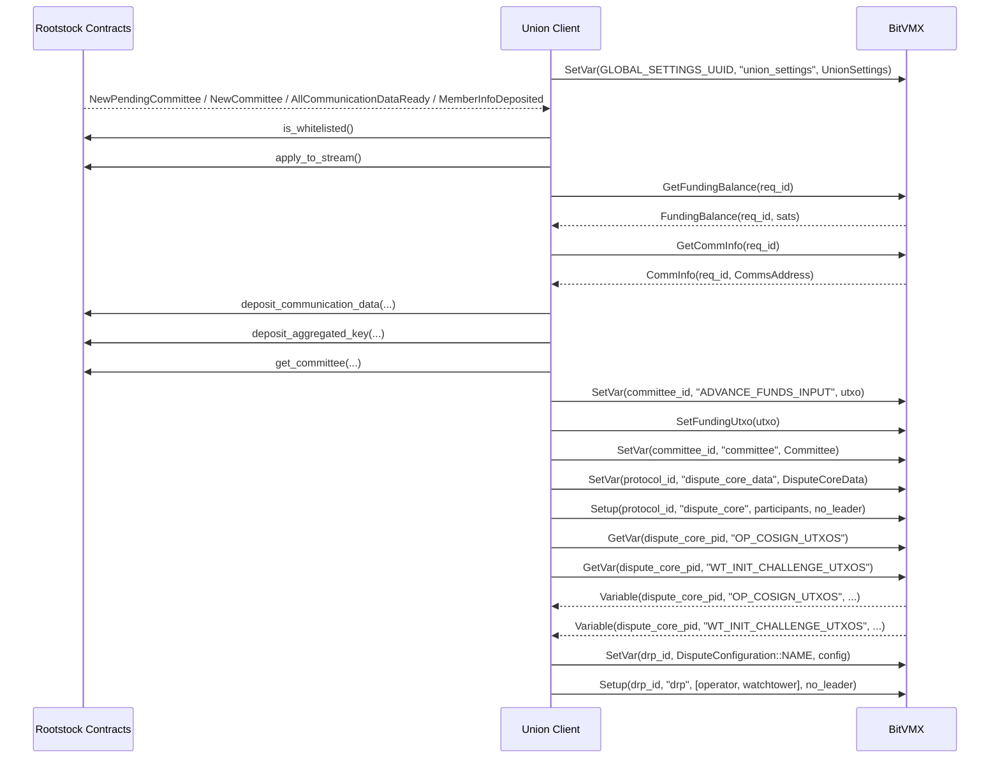
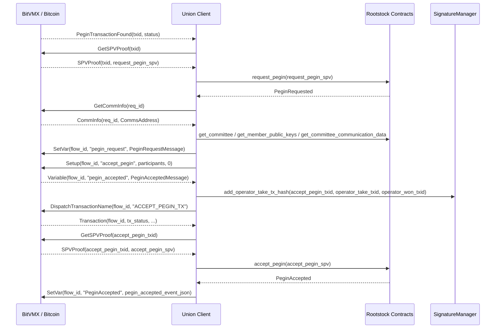
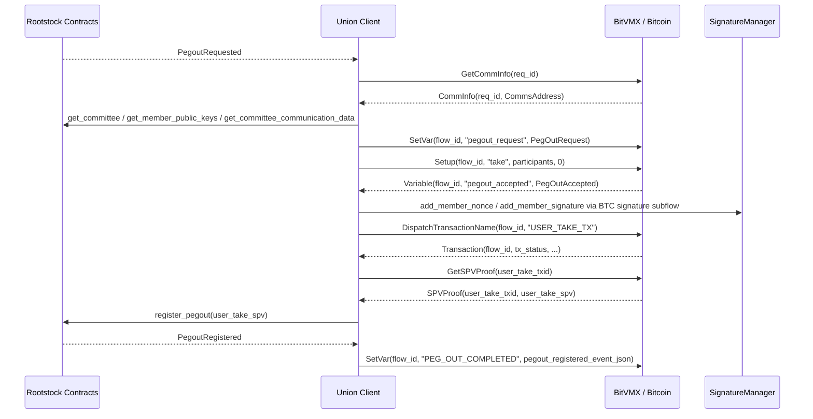
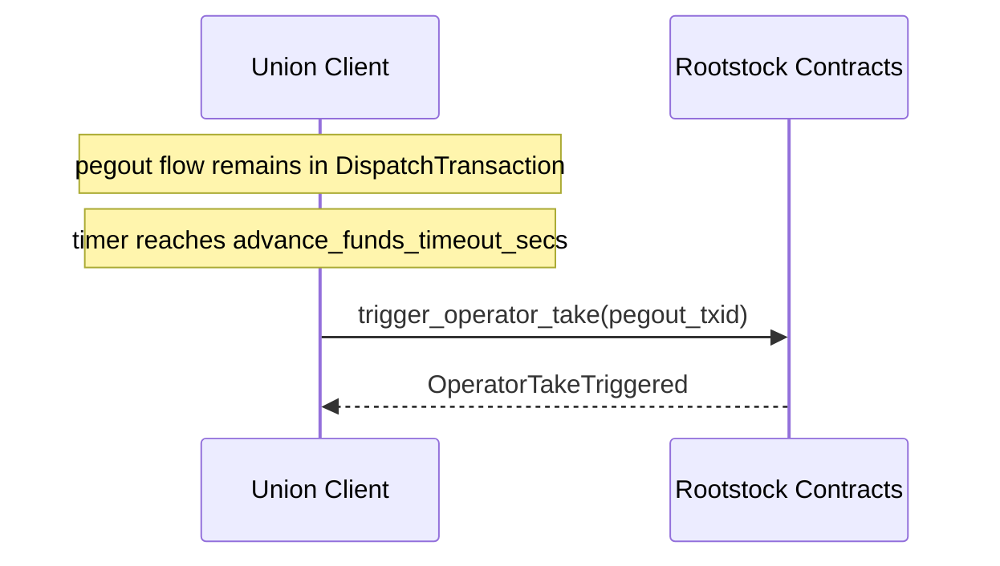
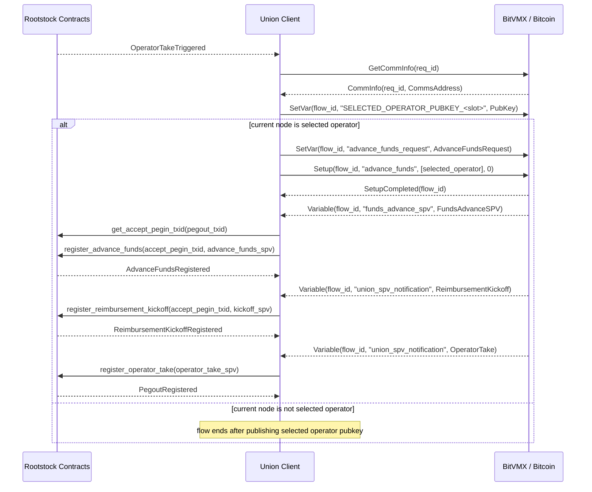

# Union Bridge Flows

This document describes the five main Union Bridge runtime flows between Rootstock smart contracts, the Union Bridge Client, and BitVMX. The goal is to show how each flow progresses over time, which milestone moves it forward, and what marks its completion.

## Intro

The Union Client sits between two networks. On the Rootstock side, it follows [contract events listened to by Union Client](rootstock-contract-events-listened-by-union-client.md), waits for the configured [confirmations, retry delays, and timeouts](confirmations-retries-and-timeouts.md), and then advances the bridge state through the relevant [contract functions called by Union Client](rootstock-contract-functions-called-by-union-client.md). On the BitVMX side, it follows the [BitVMX messages listened to by Union Client](bitvmx-messages-listened-by-union-client.md) and drives the next stage of each flow with the relevant [BitVMX actions triggered by Union Client](bitvmx-actions-triggered-by-union-client.md).

Each section focuses on the flow itself. It explains what changes in the bridge, which event or message makes that change visible, how the flow becomes more concrete or more final over time, and what can pause or divert it before completion. When a field, identifier, or transition depends on a specific derivation, the relevant detail is linked to [Parameter Sources and Mappings](parameter-sources-and-mappings.md).

## Flow: Committee Setup

Before the later bridge flows can move forward, the runtime needs a concrete committee of operators and watchtowers. That committee provides the participant list, public keys, communication endpoints, and dispute inputs that the later pegin, pegout, signature, and operator-take paths depend on.

This flow covers the transition from a committee that is only recorded on Rootstock to a committee that the runtime can actually use. By the end of the flow, the client has the member list, the communication data, the key material, and the BitVMX dispute inputs needed by the later flows.

### Sequence

The sequence starts on the BitVMX side, where the Union Client publishes `union_settings` through the relevant [BitVMX actions triggered by Union Client](bitvmx-actions-triggered-by-union-client.md). This does not make the committee ready yet, but it gives BitVMX the shared runtime context that the committee will later use.

The flow becomes visible on Rootstock when [`NewPendingCommittee`](rootstock-contract-events-listened-by-union-client.md) appears, and it advances to a concrete committee definition with [`NewCommittee`](rootstock-contract-events-listened-by-union-client.md). From there, the committee starts to accumulate the information the bridge needs. [`MemberInfoDeposited`](rootstock-contract-events-listened-by-union-client.md) shows that member-level data is being published, and [`AllCommunicationDataReady`](rootstock-contract-events-listened-by-union-client.md) shows that the communication layer is complete enough to continue.

Once the committee is visible on Rootstock, the Union Client can determine whether the local participant belongs to it. The client checks eligibility through [`is_whitelisted`](rootstock-contract-functions-called-by-union-client.md) and, when appropriate, joins through [`apply_to_stream`](rootstock-contract-functions-called-by-union-client.md). In parallel, the same participant also becomes visible on the BitVMX side. [`FundingBalance`](bitvmx-messages-listened-by-union-client.md) provides the funding context available to BitVMX, and [`CommInfo`](bitvmx-messages-listened-by-union-client.md) provides the local communication identity. At that point, the same member can be recognized on both sides of the bridge.

The next stage turns that partial state into a complete committee view that the runtime can reuse. The Union Client publishes its own communication and key material through [`deposit_communication_data`](rootstock-contract-functions-called-by-union-client.md) and [`deposit_aggregated_key`](rootstock-contract-functions-called-by-union-client.md), and then reads back the consolidated committee state through [`get_committee`](rootstock-contract-functions-called-by-union-client.md), [`get_committee_communication_data`](rootstock-contract-functions-called-by-union-client.md), and [`get_member_public_keys`](rootstock-contract-functions-called-by-union-client.md). By then, the runtime has a concrete committee, communication routes, and key material that it can carry into the dispute setup.

The final stage begins when the Union Client publishes the dispute-related inputs into BitVMX, including `ADVANCE_FUNDS_INPUT`, `committee`, and `dispute_core_data`, and starts the `dispute_core` programs through the corresponding [BitVMX actions triggered by Union Client](bitvmx-actions-triggered-by-union-client.md). The flow reaches a usable completion point when BitVMX returns the dispute-core outputs `OP_COSIGN_UTXOS` and `WT_INIT_CHALLENGE_UTXOS`. At that point, the committee is ready to support the dispute channels and, with them, the later pegin, pegout, signature, and operator-take paths.

This flow can pause if the local member is not eligible, if committee data is still incomplete, if communication endpoints or key material are still missing, or if BitVMX does not return the expected funding and dispute variables. It is also delayed by the Rootstock confirmation rules attached to the committee events that define when the setup can be treated as stable.

## Flow: Pegin

The pegin flow turns a Bitcoin-side deposit into a Rootstock-side accepted pegin. It starts with a deposit that exists only as a Bitcoin observation, then moves to a pegin that is recognized by Rootstock, then to a pegin with an official bridge identity, and finally to a pegin that is accepted and closed.

### Sequence

The flow begins when BitVMX reports [`PeginTransactionFound`](bitvmx-messages-listened-by-union-client.md). At that stage, the deposit exists on Bitcoin, but it is still only a candidate pegin from the bridge point of view. The client gives it a temporary identity derived from the Bitcoin transaction and waits for the corresponding [`SPVProof`](bitvmx-messages-listened-by-union-client.md). Once that proof is available, the pegin crosses into Rootstock through [`request_pegin`](rootstock-contract-functions-called-by-union-client.md), and the first decisive milestone appears as [`PeginRequested`](rootstock-contract-events-listened-by-union-client.md).

[`PeginRequested`](rootstock-contract-events-listened-by-union-client.md) is the point where the flow stops being only a Bitcoin-side observation and becomes an official bridge flow. This is where the flow receives its Rootstock identity through the relevant [`parameter sources and mappings`](parameter-sources-and-mappings.md), especially the `committee_id` and `slot_id` that replace the temporary txid-based identity. From then on, the flow is no longer just a detected deposit. It is a specific pegin assigned to a specific committee slot. With that identity in place, the client can publish the Rootstock-derived pegin context back into BitVMX so the accept-pegin branch can be prepared.

The next major change happens when BitVMX returns [`Variable(flow_id, "pegin_accepted", ...)`](bitvmx-messages-listened-by-union-client.md). At that point, the accept-pegin path has concrete Bitcoin transaction identifiers, including the `accept_pegin_txid`, and the flow has what it needs to move toward closure. The Bitcoin accept-pegin transaction is then dispatched and tracked until it becomes provable. When that proof is available and mature enough under the configured [confirmations, retry delays, and timeouts](confirmations-retries-and-timeouts.md), the flow returns to Rootstock through [`accept_pegin`](rootstock-contract-functions-called-by-union-client.md).

The flow is complete when [`PeginAccepted`](rootstock-contract-events-listened-by-union-client.md) confirms on Rootstock. That event marks the point where the pegin is no longer in transition between systems. It has moved from Bitcoin detection, to Rootstock recognition, to accepted bridge state. Before that point, the flow can still pause while waiting for the initial proof, the official Rootstock recognition, the accept-pegin payload, the Bitcoin transaction to mature, or the final proof to satisfy the bridge checks.

## Flow: Pegout

The pegout flow starts on Rootstock and aims to finish as a pegout that has completed its user-take path and has been registered back on Rootstock. It moves from a Rootstock request, to a Bitcoin transaction path, and then back to a Rootstock completion event.

### Sequence

The flow begins when Rootstock emits [`PegoutRequested`](rootstock-contract-events-listened-by-union-client.md). That event marks the point where the pegout exists as an official request in the bridge state. Once it satisfies the configured [confirmations, retry delays, and timeouts](confirmations-retries-and-timeouts.md), the flow gains a concrete identity through the relevant [`parameter sources and mappings`](parameter-sources-and-mappings.md), and the user-take branch can be prepared in BitVMX with the committee and communication context attached to that pegout.

The next major shift happens when BitVMX returns [`Variable(flow_id, "pegout_accepted", ...)`](bitvmx-messages-listened-by-union-client.md). At that point, the pegout has a concrete Bitcoin user-take path, including the `user_take_txid` and the signature material needed for that transaction to be dispatched. The signature stage then progresses through the relevant Rootstock milestones, especially [`AllNoncesReady`](rootstock-contract-events-listened-by-union-client.md) and [`AllSignaturesReady`](rootstock-contract-events-listened-by-union-client.md), until the user-take transaction can actually move onto Bitcoin.

From there, the flow advances toward completion by turning that prepared Bitcoin path into a provable outcome. The transaction is dispatched and then tracked through [`Transaction(flow_id, tx_status, ...)`](bitvmx-messages-listened-by-union-client.md) until it is mature enough to be proven back on Rootstock. Once the proof is accepted through [`register_pegout`](rootstock-contract-functions-called-by-union-client.md), the closing milestone appears as [`PegoutRegistered`](rootstock-contract-events-listened-by-union-client.md). That event marks the point where the pegout has completed its normal user-take route.

Before that closing milestone is reached, the flow can still stall if BitVMX does not produce the user-take payload, if the committee does not complete the signature stage, if the Bitcoin transaction does not mature, or if the Native Bridge checks still reject the proof needed for Rootstock registration.

## Flow: Operator take

The timeout-to-operator-take flow marks the point where a pegout stops advancing through its normal user-take route and is formally redirected into the operator-take branch. It is not a separate independent flow. It is the moment where one pegout branch stops and another one becomes active.

### Sequence

This branch switch begins after the pegout has already reached the state where BitVMX returned [`pegout_accepted`](bitvmx-messages-listened-by-union-client.md) and the user-take route is expected to complete. If that route does not make enough progress within the configured [confirmations, retry delays, and timeouts](confirmations-retries-and-timeouts.md), the bridge stops treating the user-take path as the active completion path. At that point, the client triggers [`trigger_operator_take`](rootstock-contract-functions-called-by-union-client.md), which makes the branch change explicit on Rootstock.

The decisive milestone of this transition is [`OperatorTakeTriggered`](rootstock-contract-events-listened-by-union-client.md). That event means the pegout is no longer progressing through the user-take route. From that point forward, the pegout continues through the operator path. The timeout itself is not a Bitcoin-proof milestone, but the resulting Rootstock event still has to satisfy the configured confirmation rules before the next flow becomes active.

## Flow: Advance funds

The operator-take flow completes a pegout after the normal user-take path has stalled. The pegout does not jump directly from timeout to closure. It advances through a sequence of operator-side milestones: first the operator branch becomes active, then the advance-funds stage becomes visible, then the reimbursement kickoff appears, and finally the pegout closes through the operator-take registration.

### Sequence

The flow begins when [`OperatorTakeTriggered`](rootstock-contract-events-listened-by-union-client.md) confirms and the pegout officially enters the operator branch. At that point, the pegout context is fixed through the relevant [`parameter sources and mappings`](parameter-sources-and-mappings.md): the `pegout_id`, committee slot, selected operator, user pubkey, and operator-take pubkey now define which branch is active and who is responsible for moving it forward. The first visible effect of that transition is that the selected operator becomes explicit for BitVMX as part of the shared flow state.

From there, the flow divides by role. For nodes that are not the selected operator, the flow effectively stops once that selected-operator state is known and shared. For the selected operator, that same moment is the start of the active completion path. The operator-side request is then published into BitVMX so the advance-funds stage can begin.

The first major milestone in that active branch is [`funds_advance_spv`](bitvmx-messages-listened-by-union-client.md). Once that proof exists and passes the relevant [confirmation rules](confirmations-retries-and-timeouts.md), the pegout is no longer simply timed out and waiting. It has entered its advance-funds stage on Rootstock through [`register_advance_funds`](rootstock-contract-functions-called-by-union-client.md). After that, the next milestone is the reimbursement kickoff, which appears through [`union_spv_notification`](bitvmx-messages-listened-by-union-client.md) and becomes official on Rootstock through [`register_reimbursement_kickoff`](rootstock-contract-functions-called-by-union-client.md). The final stage is the operator-take proof itself, which again arrives through [`union_spv_notification`](bitvmx-messages-listened-by-union-client.md) and closes the branch through [`register_operator_take`](rootstock-contract-functions-called-by-union-client.md).

The flow is complete when the operator-side path results in the final Rootstock pegout registration. Until that point, it can still pause because the current node is not the selected operator, because BitVMX has not yet produced the next proof-bearing message, or because the Native Bridge checks still require more maturity before the next Rootstock registration can be accepted.

